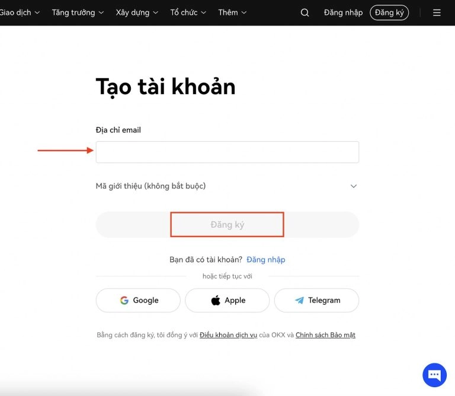
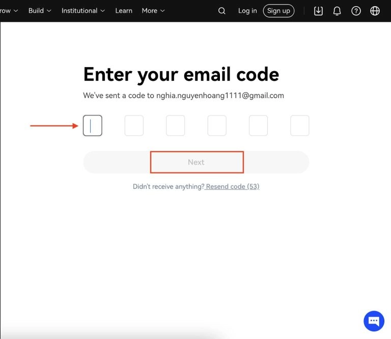
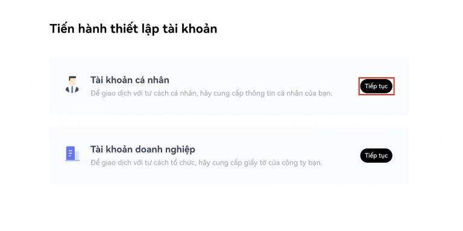
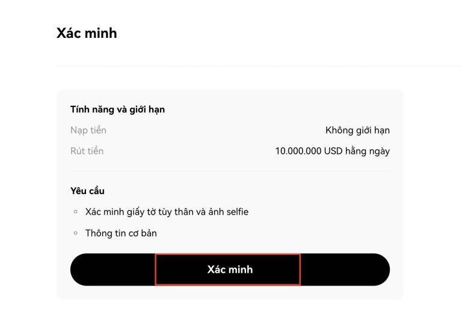
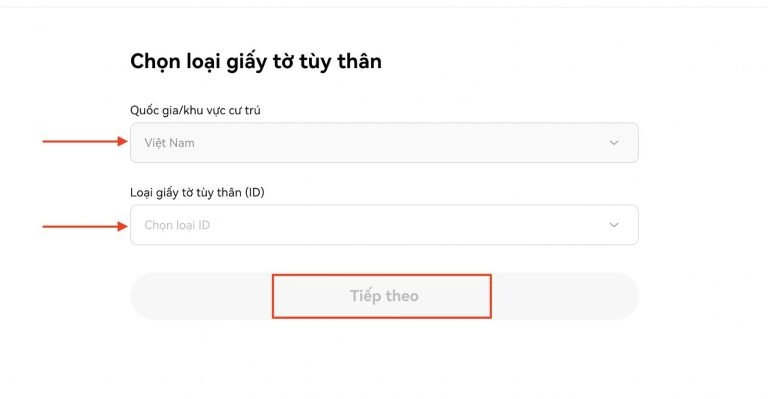

# OKX Exchange: A Straightforward Guide to Getting Started

Want to trade crypto without the headache? OKX offers spot trading, futures, options, and perpetual swaps with competitive fees starting at 0.02% for makers. Established in 2014, it serves millions worldwide with licenses in Switzerland, Canada, Australia, and the US—plus supports over 10 languages including Vietnamese. Whether you're depositing your first USDT or exploring advanced trading tools, this guide walks you through registration, verification, and your first trade.

---

So you're looking at OKX. Good choice—it's been around since January 2014, founded by Star Xu, and has grown into one of those exchanges that just... works. No drama, no fuss. It started in China but now? It's everywhere. Millions of users, offices across the globe, and a reputation that's held up pretty well over the years.

## What Actually Is OKX?

Think of it as your crypto trading hub. You've got spot trading (the basic buy-and-sell stuff), futures, options, perpetual swaps—basically everything you'd need whether you're just starting out or you've been doing this for years. The platform doesn't try to be fancy for fancy's sake. It just focuses on security and making sure your assets stay yours.

The tech behind it? Pretty solid. They've invested in security infrastructure that actually makes sense, not just the "we take security seriously" fluff you see everywhere. And when you've got over 500 people working across different offices worldwide, you know they're not operating out of someone's garage.

## The Money Talk: Fees and Costs

Let's get real about what you're paying. OKX splits users into two groups: regular folks and VIP traders (based on how much you trade in 30 days).

**Regular users** (under 10,000 BTC volume): Your fees adjust based on how much OKB you hold. Simple enough.

**VIP users**: Maker fees run from 0.02% to 0.8%, taker fees from 0.03% to 0.1%. The more you trade, the better your rates.

Deposits? Free. Well, sort of—OKX doesn't charge you, but your bank might have other ideas. Withdrawals vary by coin, so check before you move money around.

## Getting Your Account Set Up

This part's actually easy. Head to [okx.com](https://www.okx.com/join/47044926) and you've got options: phone number, email, even Telegram or Google login if you're into that.

Pick email and create a password—8 to 32 characters, needs at least one number, one uppercase letter, one lowercase, and a symbol. Yeah, it's specific, but that's security for you. Hit Sign Up, check your email for the code, punch it in, and boom—you're in.

## The Verification Dance

Here's where it gets slightly less fun but totally necessary. Click your profile icon, hit Verification, and choose between individual or business account. Most of us? Individual.

You'll need to fill in your country, full name, ID type, and ID number. Make sure everything matches your actual documents—typos here will bite you later. Submit it, and if everything checks out, you're verified and ready to trade.

## Moving Money In and Out

**Depositing**: Go to Assets, click Deposit, pick your coin. Choose the blockchain network (be careful here—wrong network means lost funds), create your wallet address if it's your first time, and copy it. Send your coins to that exact address. Double-check everything. Seriously.

**Withdrawing**: Assets menu again, select your coin, hit Withdraw. Enter the destination wallet address and amount. You'll get an OTP code to confirm—just standard security stuff.

## Actually Trading Something

First, move your coins from Funding account to Trading account. Then hit Trade, pick Basic trading, search for your trading pair (like BTC/USDT), and place your order. 👉 [Ready to start trading with lower fees and better tools?](https://www.okx.com/join/47044926) Enter how much you want to buy or sell, click Buy or Sell, and you're trading.

The interface isn't trying to win design awards, but that's fine. Everything's where you'd expect it to be.

---

## Bottom Line

OKX has been around long enough to prove it's not going anywhere. The fees are competitive, the platform works, and they've got licenses in places that actually matter. Sure, there are quirks—there always are—but for most people looking for a reliable exchange that does spot trading, futures, and everything in between, it fits the bill. The multi-language support is nice if English isn't your thing, and the security setup gives you that "okay, my money's probably safe" feeling.

If you're still shopping around for an exchange, OKX deserves a spot on your shortlist. It's not perfect, but it's solid—and sometimes that's exactly what you need. The platform continues improving based on user feedback, which means 👉 [starting your crypto journey with OKX](https://www.okx.com/join/47044926) gives you access to a mature, stable trading environment that's still evolving with the market. Use invitation code: **47044926** to get started.
